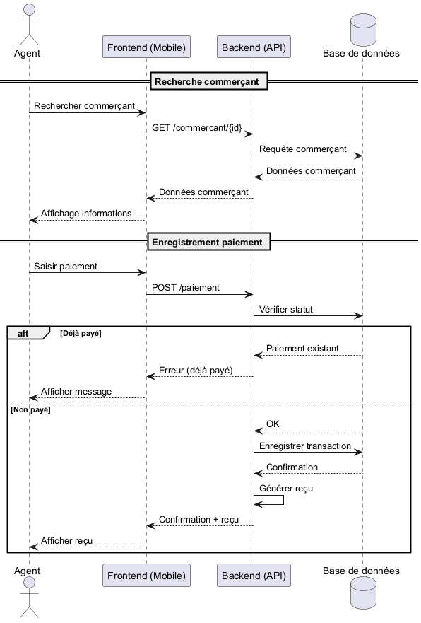

# Analyse Dynamique – Diagramme de Séquence (Enregistrement d’un Paiement)

## 1. Objectif

Le diagramme de séquence décrit les interactions chronologiques entre les différents composants du système lors de l’exécution du cas d’utilisation « Enregistrer un paiement ».

Il permet de visualiser les échanges entre l’agent, l’interface utilisateur (frontend), le serveur (backend) et la base de données.

---

## 2. Acteurs et composants impliqués

- **Agent de recouvrement** : utilisateur du système
- **Application web (Frontend)** : interface utilisée par l’agent
- **Serveur (Backend / API)** : logique métier et traitement des requêtes
- **Base de données** : stockage des informations

---

## 3. Scénario principal : Enregistrement d’un paiement

### Étapes :

1. L’agent initie une recherche de commerçant via l’application
2. Le frontend envoie une requête au backend pour récupérer les informations du commerçant
3. Le backend interroge la base de données
4. La base de données retourne les informations du commerçant
5. Le backend transmet les données au frontend
6. Le frontend affiche les informations à l’agent

---

1. L’agent initie l’enregistrement du paiement
2. Le frontend envoie les données du paiement au backend
3. Le backend vérifie le statut du commerçant

---

### Cas alternatif : commerçant déjà en règle

- Si le paiement a déjà été effectué :
    - Le backend retourne une réponse indiquant que le paiement existe déjà
    - Le frontend affiche un message d’information
    - Le processus s’arrête

---

### Flux principal (suite)

1. Le backend enregistre la transaction dans la base de données
2. La base de données confirme l’enregistrement
3. Le backend génère un reçu numérique
4. Le backend retourne la confirmation au frontend
5. Le frontend affiche le reçu à l’agent

---

## 4. Gestion de la connectivité

### Mode en ligne :

- Toutes les requêtes sont traitées en temps réel

### Mode hors ligne :

- Les données sont stockées localement dans l’application
- Une synchronisation ultérieure est effectuée avec le backend

---

## 5. Conclusion

Ce diagramme met en évidence les interactions techniques du système et constitue une base directe pour l’implémentation des API, des services backend et des appels frontend.

## 6. Illustration du diagramme de séquence

