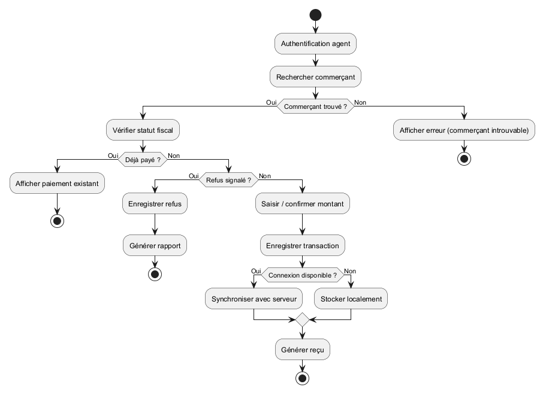

# Analyse Dynamique – Diagramme d’Activités

## 1. Objectif

Ce diagramme d’activités modélise le processus de recouvrement des taxes du point de vue du système informatique. Il représente les interactions entre l’agent et l’application ainsi que les décisions prises par le système.

---

## 2. Déclenchement du processus

Le processus débute lorsque l’agent de recouvrement initie une opération de collecte via l’application.

---

## 3. Description du flux principal

1. L’agent s’authentifie dans l’application
2. Il recherche ou identifie un commerçant
3. Le système vérifie l’existence du commerçant

---

## 4. Gestion des cas alternatifs

### 4.1 Commerçant introuvable

- Si le commerçant n’est pas trouvé :
    - Le système signale une erreur
    - Le processus est interrompu

---

### 4.2 Vérification du statut fiscal

- Si le commerçant a déjà effectué le paiement :
    - Le système affiche les informations de paiement
    - Le processus se termine
- Si le commerçant n’est pas en règle :
    - Le processus de paiement est engagé

---

### 4.3 Refus de paiement

- Si un refus est signalé :
    - Le système enregistre le refus
    - Un rapport peut être généré
    - Le processus se termine

---

## 5. Processus de paiement

Lorsque le paiement est validé :

1. L’agent saisit ou confirme le montant
2. Le système enregistre la transaction
3. Le système génère un reçu numérique

---

## 6. Gestion de la connectivité

### 6.1 Connexion disponible

- Les données sont synchronisées immédiatement avec le serveur

### 6.2 Absence de connexion

- Les données sont stockées localement
- Une synchronisation sera effectuée ultérieurement

---

## 7. Fin du processus

Le processus se termine lorsque :

- La transaction est enregistrée
- Ou qu’un cas alternatif est traité (introuvable, déjà payé, refus)

---

## 8. Conclusion

Ce diagramme représente une vision claire et structurée du fonctionnement du système. Il se concentre exclusivement sur les interactions numériques et les règles métier, en excluant les actions physiques non traçables.

## 9. Illustration du diagramme d’activités

