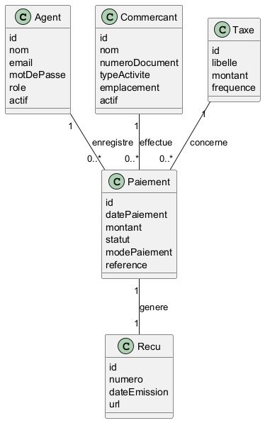

# Analyse Statique – Diagramme de Classes

## 1. Objectif

Le diagramme de classes décrit la structure statique du système de gestion des taxes du marché de la Kenya. Il définit les entités principales, leurs attributs ainsi que les relations entre elles.

Ce modèle constitue la base de conception de la base de données et des objets métiers du backend.

---

## 2. Classes principales

### 2.1 Agent

Représente un agent de recouvrement autorisé à utiliser l’application.

**Attributs :**

- id : identifiant unique
- nom : nom de l’agent
- email : adresse email
- motDePasse : mot de passe (hashé)
- role : type d’agent
- actif : statut d’activation

---

### 2.2 Commercant

Représente un vendeur opérant dans le marché.

**Attributs :**

- id : identifiant unique
- nom : nom du commerçant
- numeroDocument : numéro d’identification
- typeActivite : activité exercée
- emplacement : localisation dans le marché
- actif : statut

---

### 2.3 Taxe

Représente un type de taxe applicable.

**Attributs :**

- id : identifiant unique
- libelle : nom de la taxe
- montant : montant standard
- frequence : périodicité (journalier, mensuel…)

---

### 2.4 Paiement

Représente une transaction de paiement effectuée par un commerçant.

**Attributs :**

- id : identifiant unique
- datePaiement : date de transaction
- montant : montant payé
- statut : validé, refusé, en attente
- modePaiement : cash, mobile money…
- reference : identifiant unique de transaction

---

### 2.5 Recu

Représente le reçu généré après un paiement.

**Attributs :**

- id : identifiant unique
- numero : numéro du reçu
- dateEmission : date de génération
- url : lien vers version numérique

---

## 3. Relations entre les classes

- Un **Agent** peut enregistrer plusieurs **Paiements**
- Un **Commercant** peut effectuer plusieurs **Paiements**
- Un **Paiement** est associé à une seule **Taxe**
- Un **Paiement** génère un seul **Recu**

---

## 4. Cardinalités

- Agent (1) —— (0..*) Paiement
- Commercant (1) —— (0..*) Paiement
- Taxe (1) —— (0..*) Paiement
- Paiement (1) —— (1) Recu

---

## 5. Conclusion

Ce modèle définit les fondations du système. Il peut être directement utilisé pour implémenter la base de données relationnelle ainsi que les entités du backend.

## 6. Illustration du diagramme des classes

