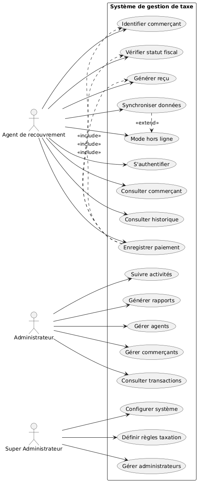

# Spécifications Fonctionnelles – Diagramme des Cas d’Utilisation

## 1. Objectif

Ce document présente les spécifications fonctionnelles du système de gestion de taxe. Il a pour objectif d’identifier les différents acteurs du système ainsi que les fonctionnalités (cas d’utilisation) auxquelles ils ont accès.

Ces éléments serviront de base pour la modélisation UML et la conception technique du système.

---

## 2. Identification des Acteurs

### 2.1 Agent de recouvrement

L’agent de recouvrement est l’utilisateur principal de l’application. Il intervient directement sur le terrain pour effectuer les opérations de collecte des taxes.

**Responsabilités :**

- Collecter les taxes auprès des commerçants
- Enregistrer les paiements
- Générer des reçus
- Assurer la synchronisation des données

---

### 2.2 Administrateur

L’administrateur est responsable de la gestion globale du système.

**Responsabilités :**

- Gérer les agents de recouvrement
- Gérer les commerçants
- Consulter les transactions
- Générer des rapports

---

### 2.3 Super Administrateur (optionnel)

Le super administrateur dispose des droits les plus élevés dans le système.

**Responsabilités :**

- Gérer les administrateurs
- Configurer le système
- Définir les règles de taxation

---

## 3. Cas d’Utilisation

### 3.1 Cas d’utilisation de l’Agent de recouvrement

- S’authentifier
- Rechercher / identifier un commerçant
- Consulter les informations d’un commerçant
- Vérifier le statut fiscal d’un commerçant
- Enregistrer un paiement
- Générer un reçu
- Consulter l’historique des transactions
- Synchroniser les données
- Utiliser l’application en mode hors ligne

---

### 3.2 Cas d’utilisation de l’Administrateur

- Gérer les agents (ajouter, modifier, désactiver)
- Gérer les commerçants (ajouter, modifier, supprimer)
- Consulter les transactions
- Suivre les activités des agents
- Générer des rapports

---

### 3.3 Cas d’utilisation du Super Administrateur

- Gérer les administrateurs
- Configurer le système
- Définir les règles de taxation

---

## 4. Relations entre les Cas d’Utilisation

### 4.1 Relations d’inclusion (<>)

Le cas d’utilisation **“Enregistrer un paiement”** inclut les cas suivants :

- Identifier un commerçant
- Vérifier le statut fiscal
- Générer un reçu

---

### 4.2 Relations d’extension (<>)

- Le cas **“Synchroniser les données”** est exécuté lorsque la connexion internet est disponible.
- Le cas **“Utiliser en mode hors ligne”** s’applique lorsque la connexion internet est indisponible.

---

## 5. Conclusion

Les cas d’utilisation identifiés couvrent les principales fonctionnalités du système conformément au cahier des charges. Ils constituent une base solide pour la modélisation des interactions du système et pour la conception technique future.

